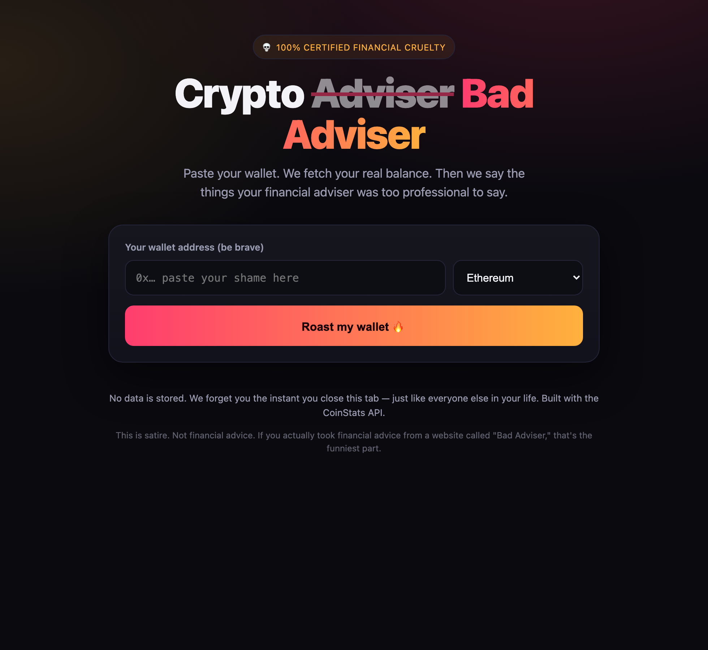
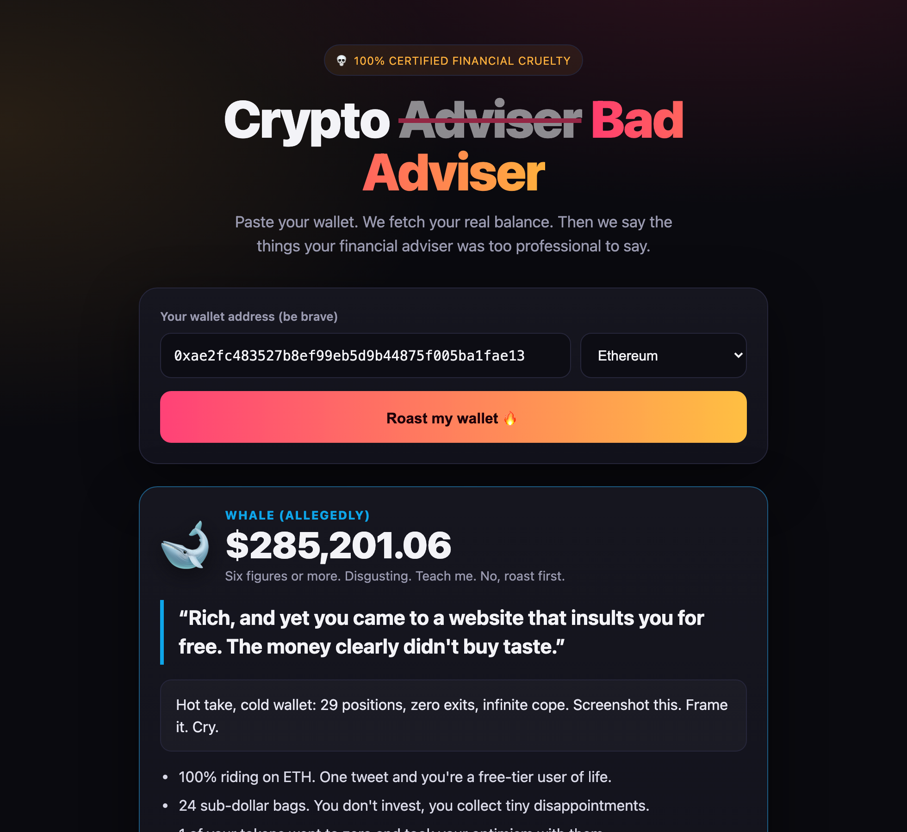
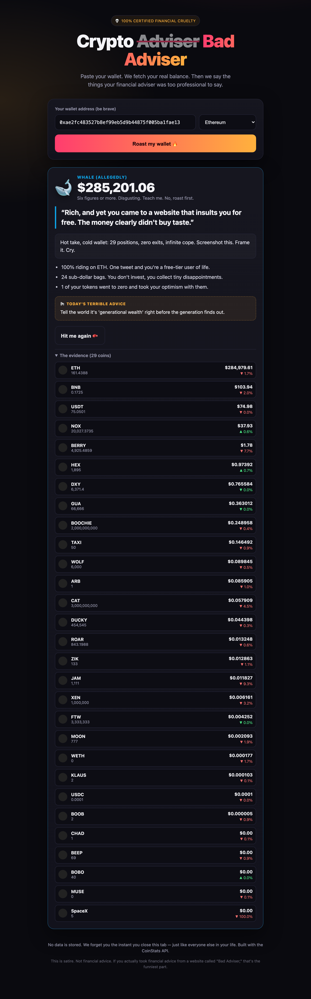

<div align="center">

# 💀 Crypto Bad Adviser

### Paste your wallet. We fetch your **real** balance. Then we hurt your feelings — free of charge.

A humorous, black-comedy web app that pulls your live on-chain portfolio from the
[CoinStats API](https://coinstats.app/api/) and roasts you based on exactly how broke
(or suspiciously rich) you are.

[](https://crypto-bad-adviser.web.app)
&nbsp;


**[🔥 Get roasted now → crypto-bad-adviser.web.app](https://crypto-bad-adviser.web.app)**

</div>

---

> ⚠️ **This is satire.** Nothing here is financial advice. The whole point is that it's
> terrible advice. If you actually act on anything this app says, that's the funniest
> possible outcome.

## 📸 Screenshots

|                    Landing                     |                  The roast                  |
| :--------------------------------------------: | :-----------------------------------------: |
|   |  |

<div align="center">

### The evidence (your actual holdings)



</div>

## ✨ Features

- **Real balances, real shame** — fetches live token holdings for any wallet via the
  [CoinStats Open API](https://coinstats.app/api/).
- **8 roast tiers** — from `$0` 🪦 _"The Void Stares Back"_ all the way up to six-figure
  🐋 _"Whale (Allegedly)"_, each with its own color, emoji, and personality.
- **Effectively unlimited insults** — a combinatorial generator stitches together
  opener × burn × kicker fragments (~2,000+ base combos) with **your actual coins spliced
  in**, multiplied by per-tier line pools and targeted "bag jabs."
- **Targeted bag jabs** — calls out over-concentration, dust bags, rugged/zeroed coins,
  single-coin gambles, and today's bleeders.
- **Multi-chain** — network dropdown auto-populated from CoinStats' supported blockchains.
- **"Hit me again 🥊"** — rerolls every line so the pain stays fresh.
- **Zero backend** — pure static SPA; CoinStats is called directly from the browser.
- **Privacy by laziness** — nothing is stored. We forget you the instant you close the tab.

## 🛠 Tech Stack

| Layer    | Choice                                                          |
| -------- | -------------------------------------------------------------- |
| UI       | [React 18](https://react.dev) + [Vite 5](https://vitejs.dev)  |
| Styling  | Hand-rolled CSS (dark theme, gradients, zero UI deps)         |
| Data     | [CoinStats Open API](https://coinstats.app/api/) `/wallet/*`  |
| Hosting  | [Firebase Hosting](https://firebase.google.com/docs/hosting)  |
| Shots    | [Playwright](https://playwright.dev) (`scripts/shoot.mjs`)    |

## 🚀 Getting Started

### Prerequisites

- Node.js 18+
- A CoinStats API key — grab one at **<https://coinstats.app/api/>**

### Setup

```bash
# 1. Install dependencies
npm install

# 2. Configure your API key
cp .env.example .env
#   then edit .env and set both values to your key:
#   COINSTATS_API_KEY=...        (used by the Vite dev proxy)
#   VITE_COINSTATS_API_KEY=...   (embedded in the static build)

# 3. Run the dev server
npm run dev
```

Open the printed URL, paste a wallet address, and brace yourself.

> **Try this one:** `0xae2fc483527b8ef99eb5d9b44875f005ba1fae13` on Ethereum 🐋

## 📡 The CoinStats API

This project is built on the **[CoinStats Open API](https://coinstats.app/api/)**. The two
endpoints used:

| Endpoint                | Purpose                                             |
| ----------------------- | --------------------------------------------------- |
| `GET /wallet/blockchains` | Lists supported chains for the network dropdown.    |
| `GET /wallet/balance`     | Returns token holdings (`amount`, `price`, …).      |

Net worth is computed client-side as **Σ (`amount` × `price`)** across every token, which
selects the roast tier. Requests send your key in the `X-API-KEY` header. CoinStats
responds with `access-control-allow-origin: *`, so the browser can call it directly with no
proxy required.

> 📖 Full API docs & key signup: **<https://coinstats.app/api/>**

### 🔐 A note on the API key

In the static build, the key is **embedded in the client bundle** and therefore publicly
visible. That's an accepted tradeoff for this joke app. For a production-grade setup, route
calls through a server-side proxy (e.g. a Firebase Cloud Function) that injects the key and
keep it out of the bundle — scaffolding for this exists in `vite.config.js` (the dev proxy)
as a reference.

## 🏗 Build & Deploy

```bash
# Production build (outputs to dist/)
npm run build

# Preview the build locally
npm run preview

# Deploy to Firebase Hosting
firebase deploy --only hosting --project testing-index
```

The site is hosted as a dedicated Firebase Hosting site (`crypto-bad-adviser`) inside the
`testing-index` project — see `firebase.json` and `.firebaserc`.

### Regenerating screenshots

```bash
node scripts/shoot.mjs            # shoots the live site into docs/screenshots/
SHOOT_URL=http://localhost:5173 node scripts/shoot.mjs   # or shoot a local dev server
```

## 📁 Project Structure

```
crypto-bad-adviser/
├── index.html              # App shell + meta tags
├── vite.config.js          # Vite config + dev proxy (key-injection reference)
├── firebase.json           # Hosting config (SPA rewrites, cache headers)
├── .firebaserc             # Firebase project/site targets
├── scripts/
│   └── shoot.mjs           # Playwright screenshot capture
├── docs/screenshots/       # README images
└── src/
    ├── main.jsx            # React entry
    ├── App.jsx             # UI, form, fetch + result rendering
    ├── api.js              # CoinStats API client
    ├── roasts.js           # Tiers, advice, combinatorial roast generator
    └── styles.css          # Theme & layout
```

## 🤝 Contributing

PRs that add new roasts are welcome — the more creative the emotional damage, the better.
Add lines to the relevant tier in `src/roasts.js`, or expand the `OPENERS` / `BURNS` /
`KICKERS` pools to grow the combinatorial space. Keep it self-directed (the app roasts the
user about their _own_ wallet) and punching-at-nobody.

## 📄 License

[MIT](LICENSE) © 2026 Rafael Muradyan

---

<div align="center">
<sub>Built with the <a href="https://coinstats.app/api/">CoinStats API</a> and a complete lack of empathy. WAGMI — statistically, some of us. Not you.</sub>
</div>
